# Setting up Active Directory

Active Directory is a service that allows the interconnection of computers and user accounts. For example, you can log into a user account on many different computers on a domain with the same credentials. 

Permissions to resources can be allocated using AD, for example the permission to view files on a server, or even access rights (inability to logon during out-of-office hours). 

It's also used to allocate permissions to server services (I use it to connect to my desktop's Hyper-V server from my laptop, you could also use it for access to a VPN server, etc).

This process will work for Windows Server 2012R2, 2016 and 2019, I can't speak for 2012 or older but the terminology should be the same.

## Method

### 1) Set the server's name

In a professional situation, servers should be named sensibly according to their location, role, etc. If there are many servers, or if they are spread across different locations, this is more important. CHELT-DC01 and CHELT-DC02 could identify the Cheltenham's 1st and 2nd domain controllers.

When a computer/server joins a domain, it gets an extended computer name. For example, [KNIGHT.INDRA.local](http://knight.INDRA.local), where KNIGHT is the computer name and INDRA.local is the domain.

Open "Local Server" on the left pane of Server Manager, and click the server's name.

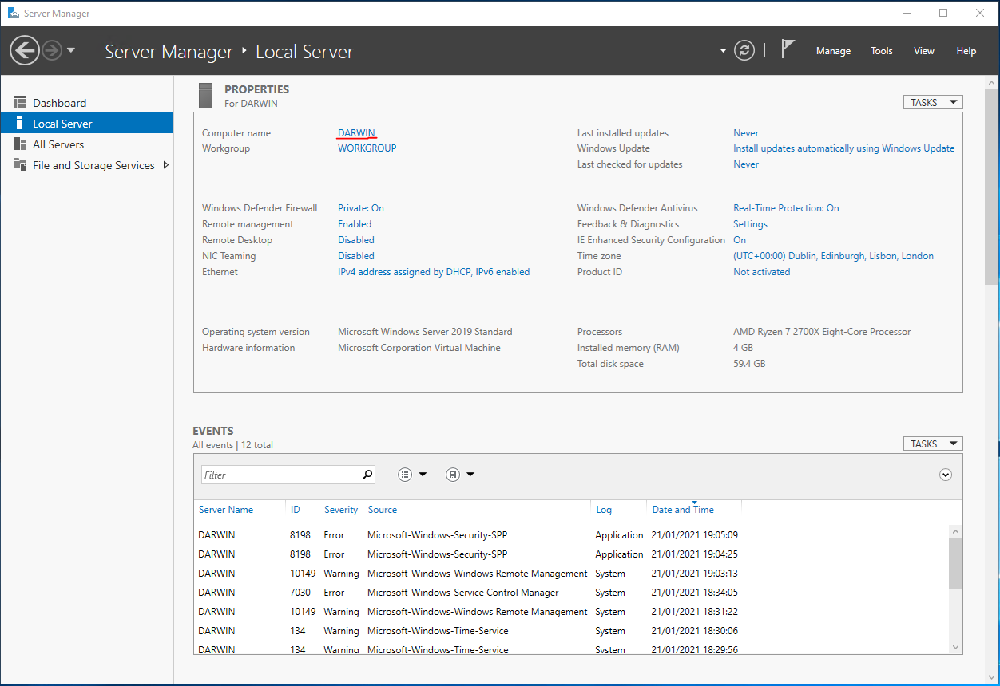

Press "Change", type the new server name, then press OK and restart the server.

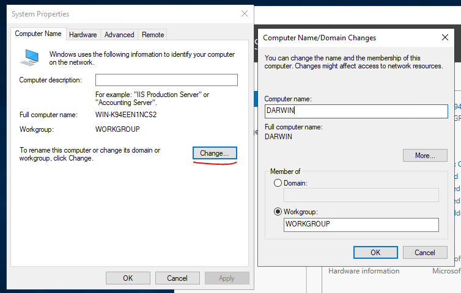

### 2) Set a static IP address

This is very important because we will be hosting a DNS server on here too. DNS is crucial to Active Directory!

Microsoft does not recommend disabling IPv6 because they don't do any QA with it disabled, however it's not uncommon to disable it on an AD due to issues with DNS. I have disabled IPv6.

Open Network and Sharing Center via Control Panel, find the primary network adapter and open its properties - optionally unchecking IPv6 - open IPv4's properties and set them as required (these can be pulled straight from ipconfig in command prompt if required).

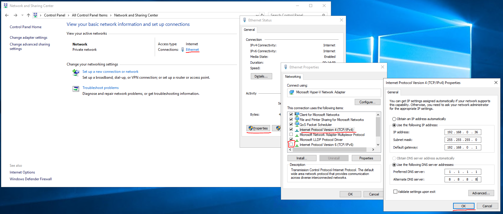

### 3) Install the relavent Active Directory roles

Find "Manage" on the toolbar and select "Add Roles and Features".

Select "Role-based or feature-based installation" and press next.

Select your server from the server pool (identifiable from hostname and IP address).

Check "Active Directory Domain Services", then press "Add Features", leaving "Include management tools" checked, then press next

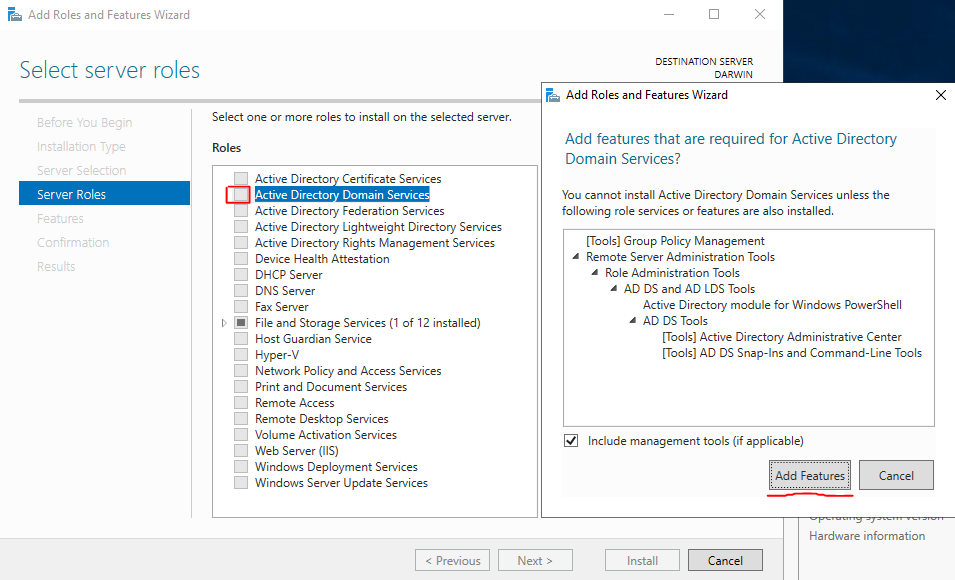

Leaving all options unchanged, press next.

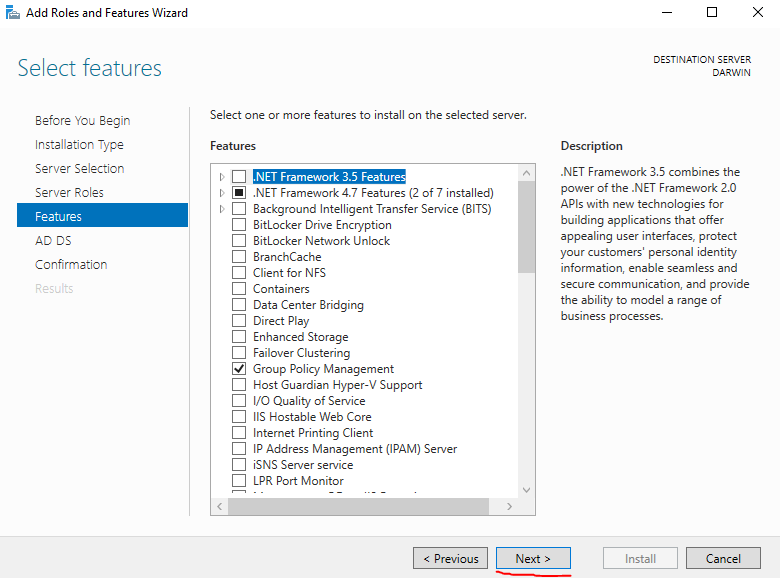

Press next.

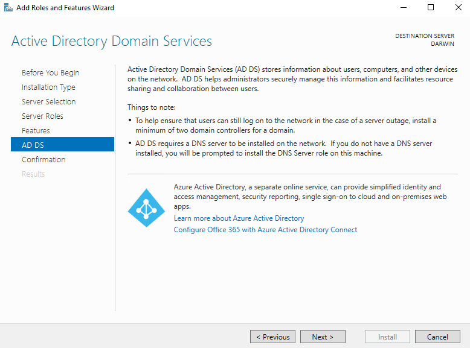

Press install.

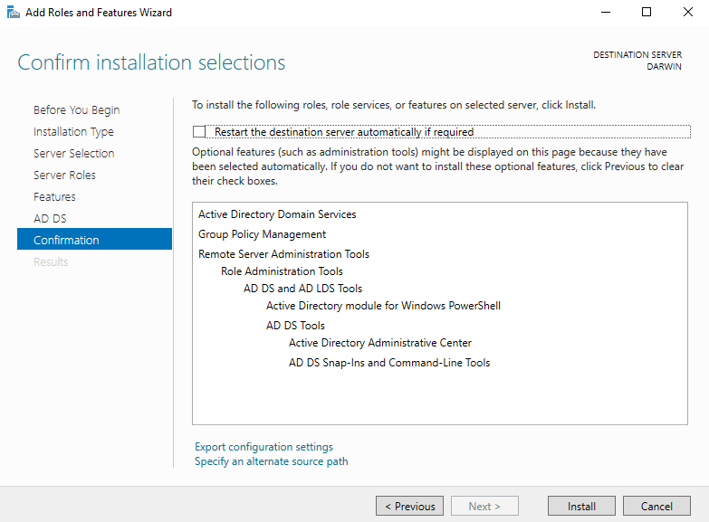

Once this is done, press close. 

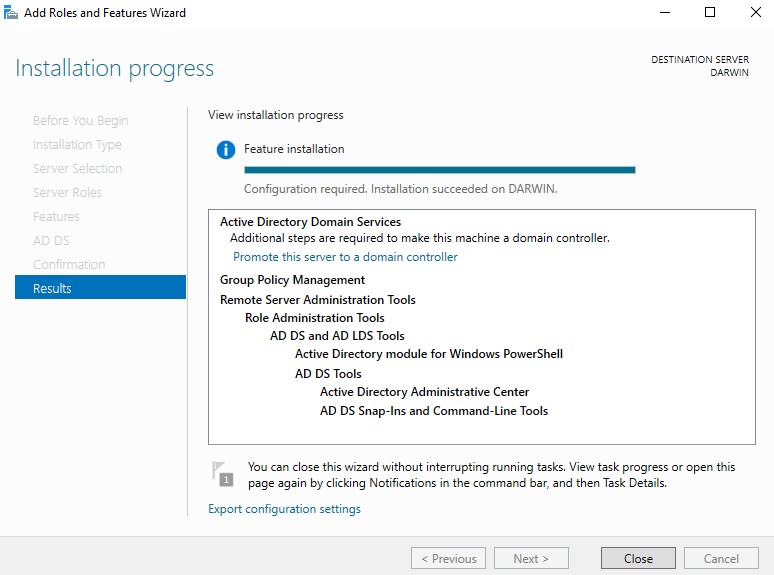

### 4) Configure the Active Directory role

Open the flag, then press "Promote the server to a domain controller".

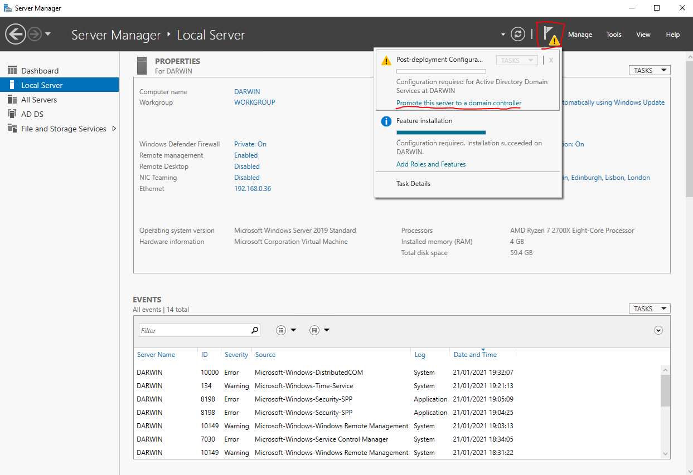

A forest is the highest logical entity in an Active Directory. It holds domains, computers, and users. One forest can hold more than one domain. 

A root domain name is the highest domain entity. The root domain name is prefix.suffix (domainname.local usually). You can also use subdomains (internal.prefix.suffix) if required. 

Select "Add a new forest" and enter your root domain name. To keep it simple, this domain will be called "testad.local". Enter this and press next.

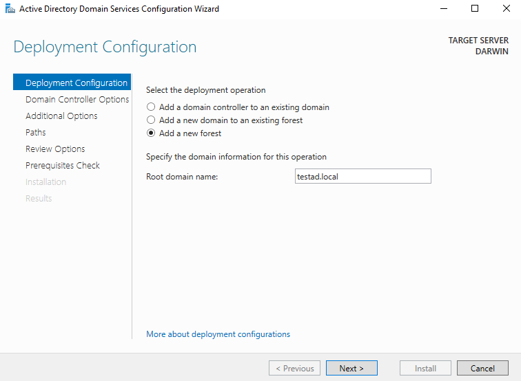

DSRM (Directory Services Restore Mode) is a safe-mode for AD that allows an administrator to repair or rebuild the AD database.

Leave all options as they are, enter a password for DSRM and press next.

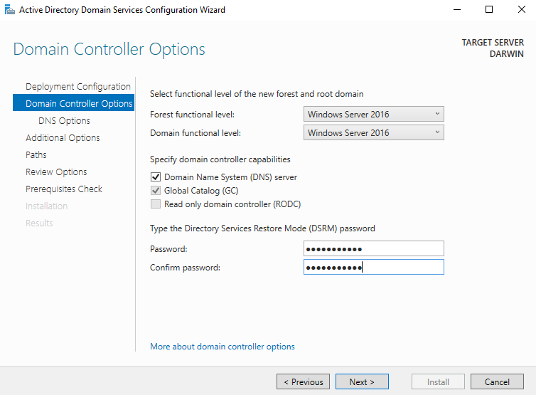

Leave options regarding DNS delegation unchanged and press next.

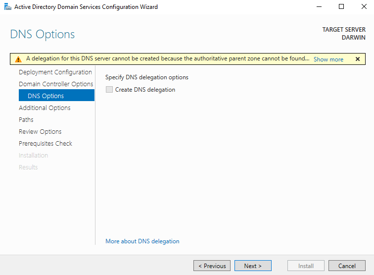

Leave the NetBIOS domain name unchanged and presss next.

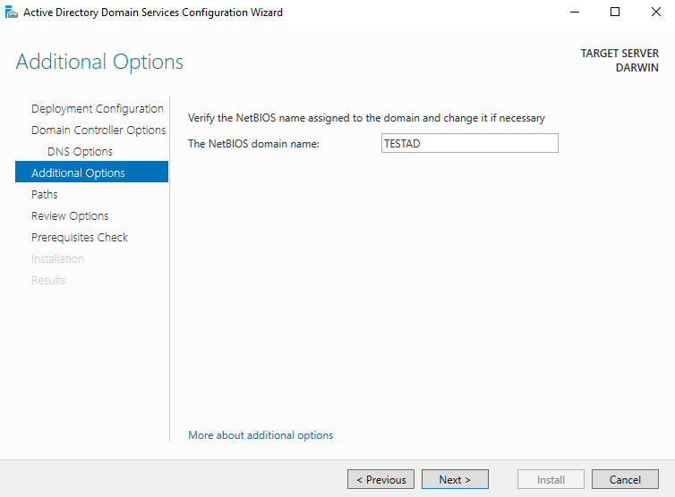

Leave all file paths unchanged and press next.

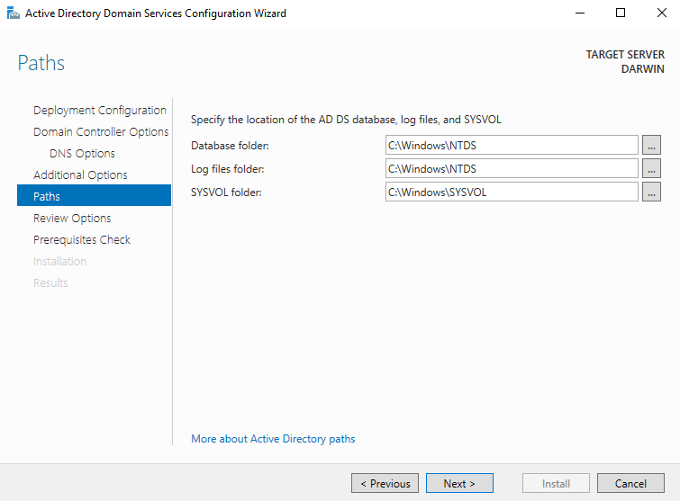

Press next.

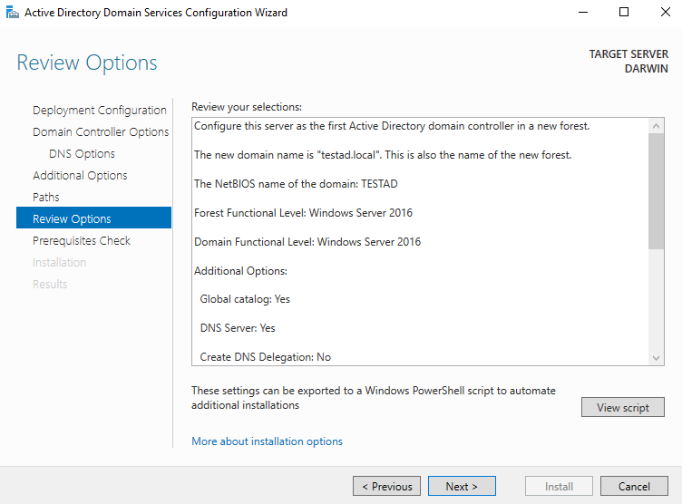

If all prerequisites pass, press install. The server will automatically restart.

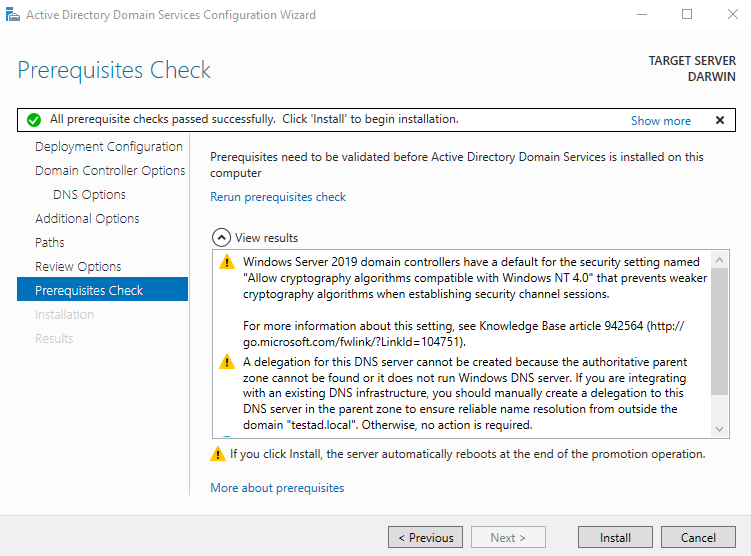

### 5) Logon as server administrator

Once the server has restarted, you will be greeted with a vacant logon screen. Use the username "Administrator" using whatever password you used to setup the server initially.

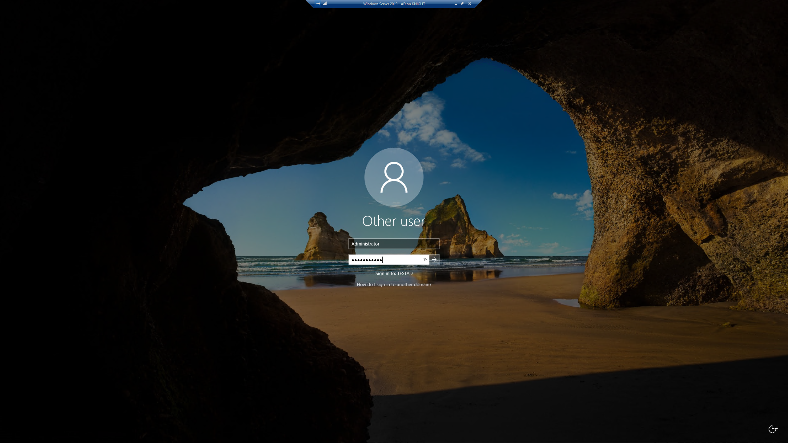

### Active Directory Domain Services are now installed on your server.

To connect a computer or other server to your new domain, you will need to configure the device to use your AD server as a DNS server before attempting to join the domain.
